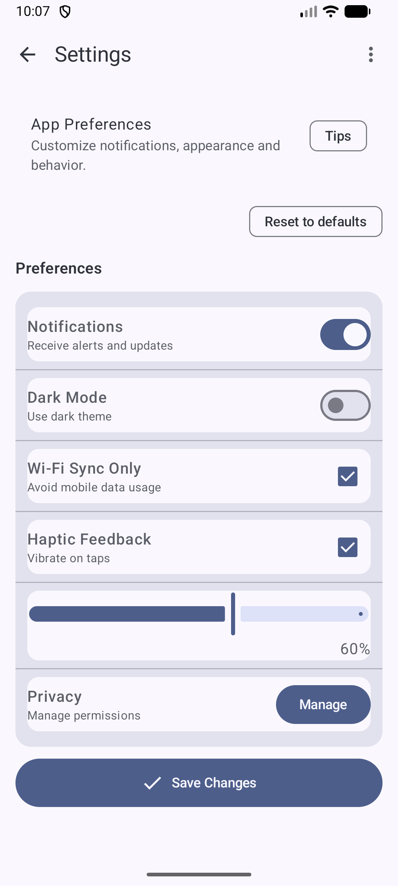

# CS501 IA3 - Q1 Row/Column Mastery: Settings Screen

**Student:** Wenhao Wang  
**Assignment:** Individual Assignment 3 (Q1)  
**Question:** Row/Column Mastery: Settings Screen

## Overview
This project implements a polished and consistent **Settings screen** using Jetpack Compose and Material 3.

The screen is built to demonstrate correct **Row/Column composition**, alignment, and modifier usage.

---

## Q1 Requirements Addressed

### Layout Requirements
- ✅ Uses a **Column** as the main layout container
- ✅ Each setting item is a **Row**
  - Left side: **label + supporting text** (nested `Column`)
  - Right side: a control (`Switch`, `Checkbox`, `Slider`, or `Button`)
- ✅ Uses `Modifier.weight()` to prevent text truncation and keep controls aligned

### Material 3 Requirements (6+ components)
This screen uses Material 3 components including:
- `TopAppBar`
- `Card`
- `ListItem` (if applicable in your version)
- `Switch`
- `Checkbox`
- `Slider`
- `Divider`
- `AssistChip`
- `Button`
- `Text`

### Modifier Requirements
This screen demonstrates:
- `padding(...)`
- `fillMaxWidth()`
- `weight(...)`
- `heightIn(...)` / `sizeIn(...)`
- `align(...)`
- At least one of:
  - `border(...)`
  - `clip(...)`
  - `background(...)`
  - `clickable(...)`

---

## Implementation Notes
- The UI is designed to look visually consistent across rows.
- Controls are aligned on the right side for a standard settings-screen appearance.
- Supporting text improves clarity and usability.

---

## Screenshot

---

## How to Run
1. Open the project in **Android Studio**
2. Sync Gradle if prompted
3. Run on an emulator or Android device
4. Make sure `MainActivity.kt` displays the Q1 screen composable

---

## AI Disclosure
I used ChatGPT as a coding assistant for:
- planning the Compose layout structure (Row/Column nesting)
- debugging Compose errors and modifier usage
- refining UI consistency and README documentation

All code was reviewed, edited, and tested by me before submission.

---

## Repository Link
<!-- Replace with your actual Q1 repo link -->
https://github.com/JefferyWenhaoWang/cs501-ia3-q1
